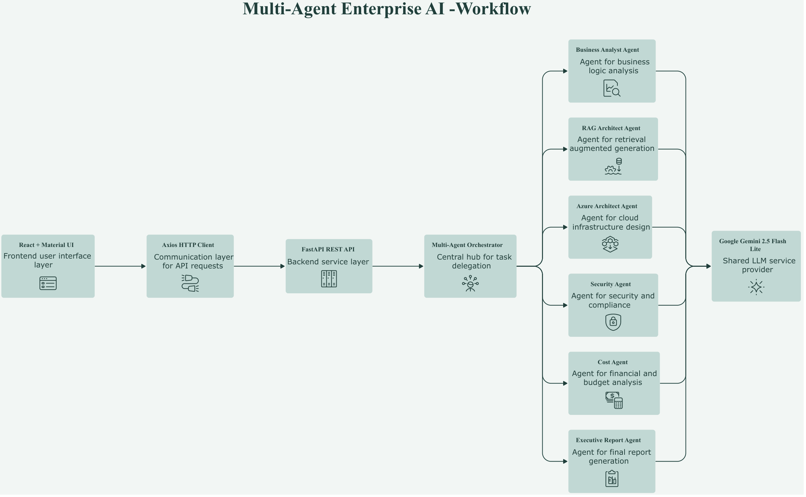
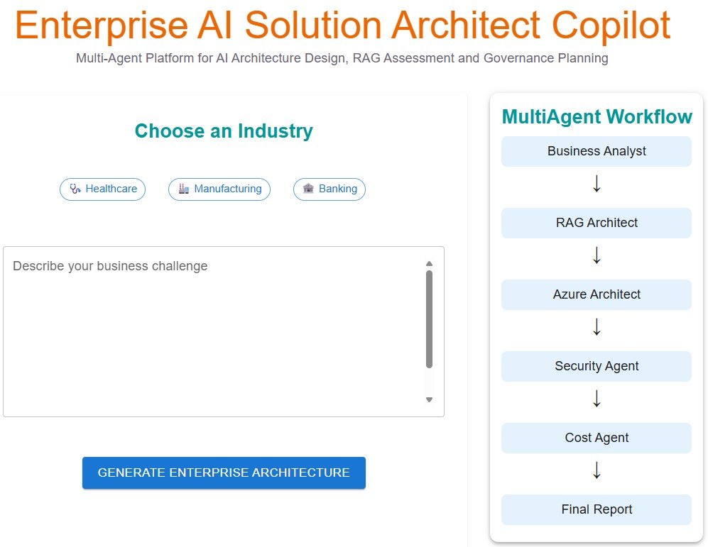
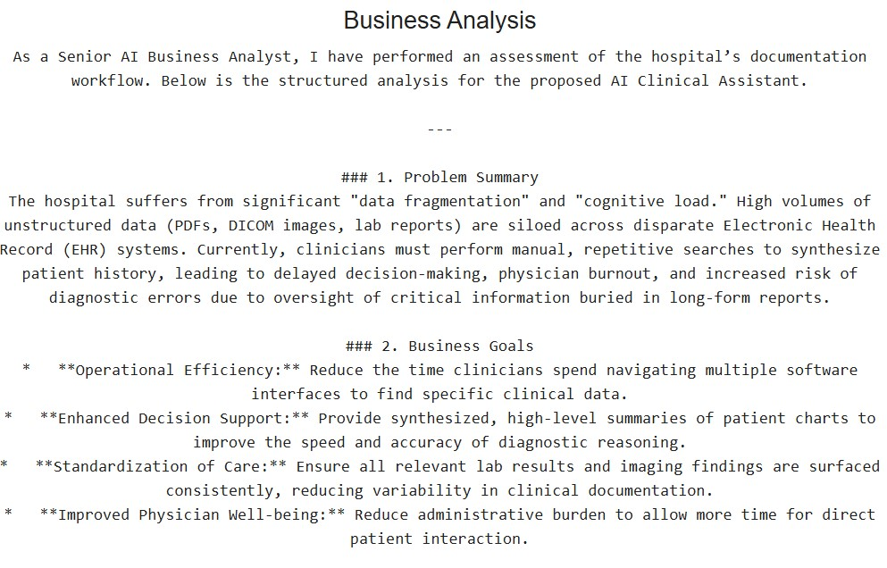

# Enterprise AI Solution Architect Copilot

A full-stack **Multi-Agent Generative AI platform** that automates enterprise AI solution design, Retrieval-Augmented Generation (RAG) assessment, Azure AI architecture planning, security and governance evaluation, cost estimation, and executive reporting.

The platform enables users to describe a business challenge in natural language and automatically generates a structured enterprise AI solution by orchestrating multiple specialized AI agents powered by **Google Gemini 2.5 Flash Lite**.

---

# Key Features

* Multi-Agent AI orchestration
* Automated business analysis
* Intelligent RAG assessment
* Azure AI architecture recommendations
* Security and governance planning
* Cost estimation and optimization
* Executive-level solution report
* Modern React frontend with Material UI
* FastAPI backend with REST APIs
* Google Gemini 2.5 Flash Lite integration

---

# System Architecture

The application follows a modular multi-agent architecture where a React frontend communicates with a FastAPI backend through REST APIs. A central orchestrator coordinates multiple specialized AI agents that collaboratively generate an enterprise AI solution.





---

# Application Overview

### Landing Page

The application allows users to describe an enterprise business challenge, select example scenarios, and automatically generate a complete AI solution architecture.




---

### Generated Business Analysis

The first AI agent performs a structured business analysis by identifying the business problem, objectives, operational challenges, and expected outcomes before the remaining specialized agents continue the solution generation process.




---

# Multi-Agent Workflow

The request is processed sequentially through six specialized AI agents:

1. Business Analyst Agent
2. RAG Architect Agent
3. Azure Architect Agent
4. Security Agent
5. Cost Agent
6. Executive Report Agent

Each agent focuses on a specific domain and contributes its expertise to generate a comprehensive enterprise AI solution.

---

# Technology Stack


## Frontend

* React
* Material UI
* Axios

## Backend

* Python
* FastAPI
* Uvicorn

## AI

* Google Gemini 2.5 Flash Lite
* Prompt Engineering
* Multi-Agent Orchestration

---

# Project Structure

```text
enterprise-ai-solution-architect/

├── frontend/
│   ├── src/
│   ├── components/
│   └── App.jsx
│
├── backend/
│   ├── agents/
│   │   ├── business_agent.py
│   │   ├── rag_agent.py
│   │   ├── azure_agent.py
│   │   ├── security_agent.py
│   │   ├── cost_agent.py
│   │   └── executive_agent.py
│   │
│   ├── orchestrator.py
│   ├── main.py
│   └── requirements.txt
│
└── README.md
```

---

# Installation

## Clone the repository

```bash
git clone https://github.com/YOUR_USERNAME/enterprise-ai-solution-architect.git
```

---

## Backend

```bash
cd backend

python -m venv venv

venv\Scripts\activate

pip install -r requirements.txt

uvicorn main:app --reload --port 8001
```

---

## Frontend

```bash
cd frontend

npm install

npm run dev
```

---

# Example Use Case

Input

> "A hospital receives thousands of PDF reports, medical images and lab results every day. Doctors spend significant time searching across disconnected systems. Design an enterprise AI solution that improves clinical decision making while maintaining regulatory compliance."

Generated Outputs

* Business Analysis
* RAG Assessment
* Azure AI Architecture
* Security & Governance Review
* Cost Estimation
* Executive Report

---

# Example Demonstrations

## Manufacturing – Mass Customization

The following recording demonstrates a complete execution of the multi-agent workflow using a realistic manufacturing business challenge.

https://github.com/user-attachments/assets/3a1c43e3-0f22-410c-a6a6-606c26c14b36

---

# Future Improvements

* Azure AI Search integration
* Vector database support
* Document ingestion pipeline
* Azure AI Foundry integration
* MCP support
* LangChain integration
* Authentication and user management
* Docker deployment
* Azure Container Apps deployment

---

# Author

Developed as a personal AI engineering project demonstrating enterprise-scale multi-agent system design using React, FastAPI, Python, and Google Gemini.

---

# License

This project is intended for educational and portfolio purposes.
